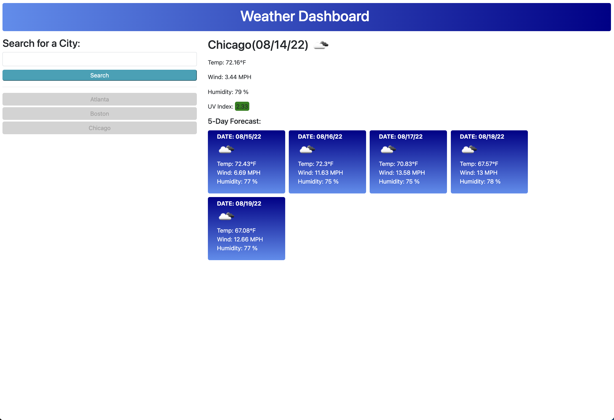

# Check Your Weather - Michael Martens

Here's what the code does:

Index.html houses the main structure of the site.
Style.css handles the styling.

Users can search any city to view the current weather and future 5-day forecast. Searches will save to localStorage and when past searches are clicked, that citie's data will re-populate the screen.

In terms of the search itself, temperature, wind, humidty, UVIndex, and weather icon are included in the current weather results. Temperature, wind, humidity, and weather icon are returned in the forecast.

For UVIndex, depending on the value you'll see a corresponding color represented based on EPA guidelines.

TODO: Fix search history dom logging

View the site here: https://makeithappenmike.github.io/check-your-weather-app/

Contributions by Michael Martens

Screenshot:

